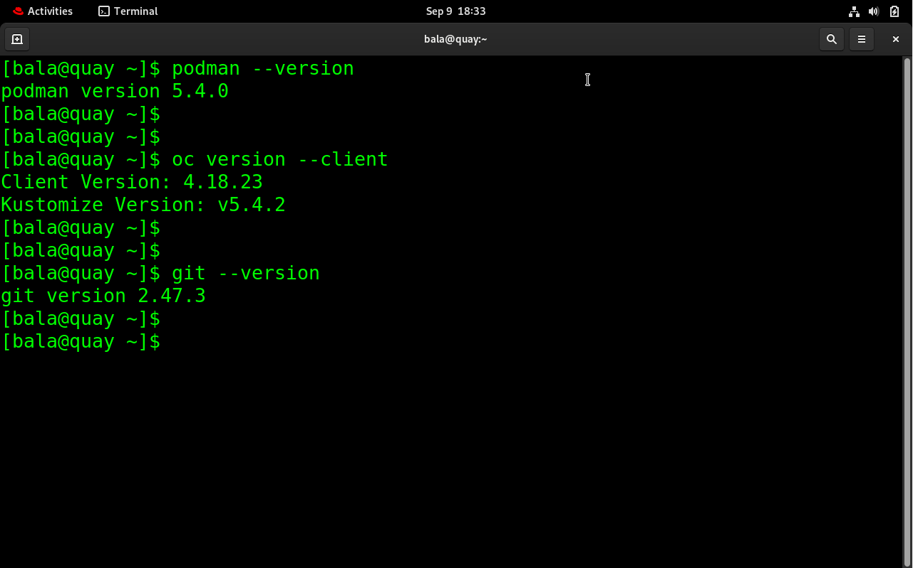
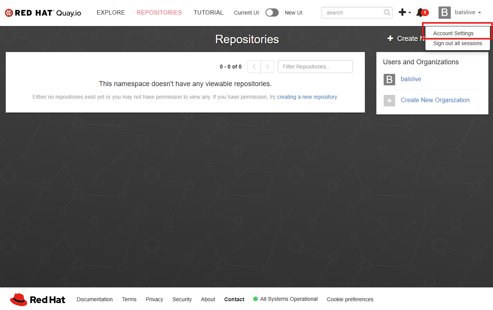
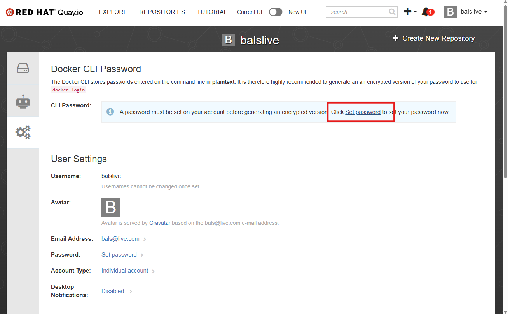
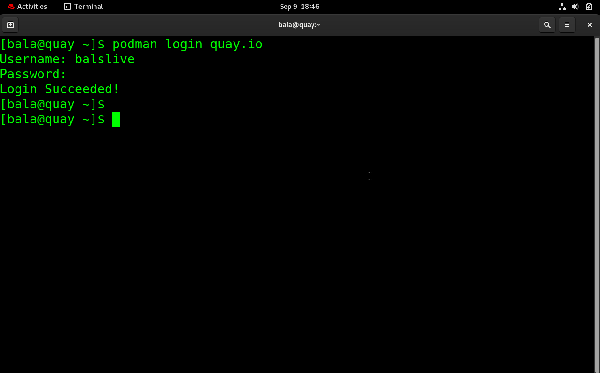
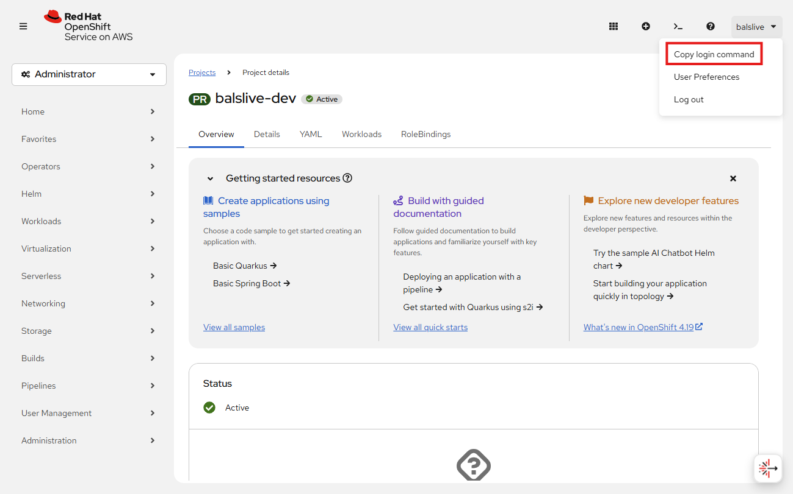
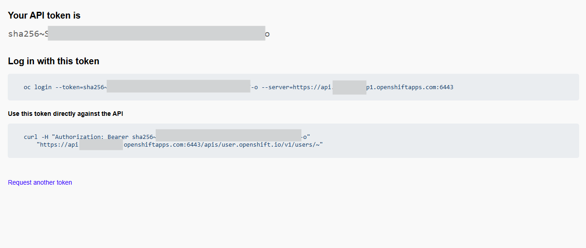
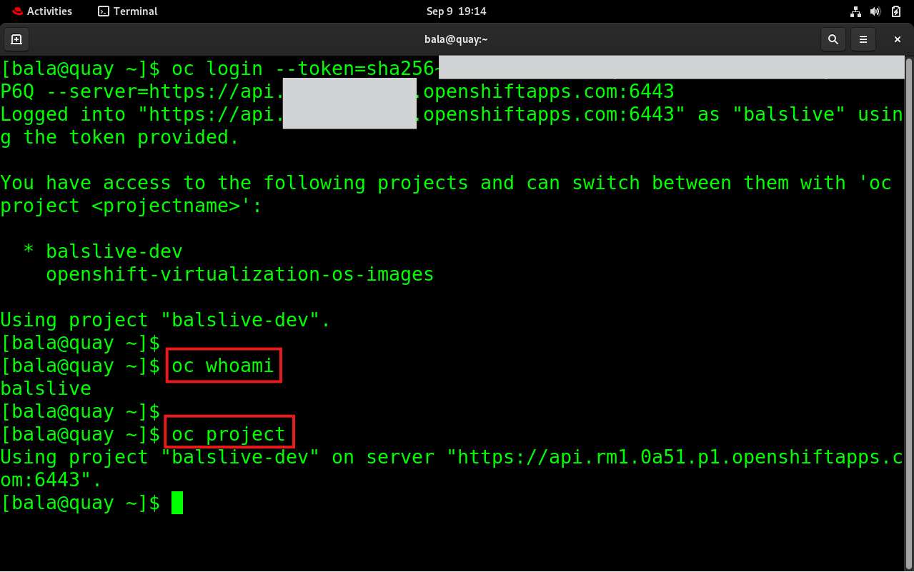
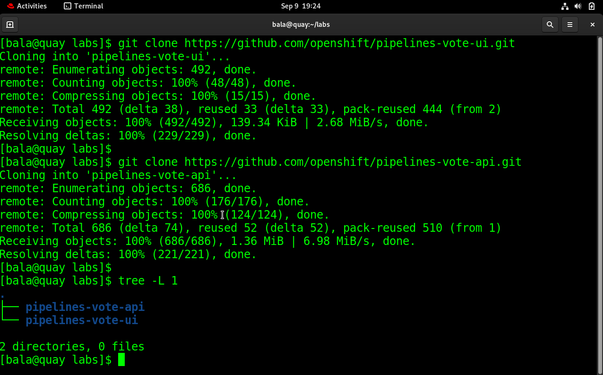

# Lab 1: Manual Deployment to OpenShift

## Objective

Manually containerize and deploy a sample application (UI + API) to an OpenShift cluster using your own Quay.io registry.

**Repos used:**

* UI: [https://github.com/openshift/pipelines-vote-ui](https://github.com/openshift/pipelines-vote-ui)
* API: [https://github.com/openshift/pipelines-vote-api](https://github.com/openshift/pipelines-vote-api)

At the end of the lab, you will have:

* Two contianer images (UI & API) in **Quay.io** under your organization
* A working application deployed to your **OpenShift** project/namespace

<br/>

## Prerequisites (should be done before the lab)

1. **Red Hat Sandbox**: Create an account at `sandbox.redhat.com` and launch an OpenShift cluster.
2. **Quay.io**: Log in using the same Red Hat credentials.
3. **GitHub**: Make sure you can log in to your account.

> You’ll receive a **VM** to run commands from. Keep your openshift cluster console open in a browser tab.

<br/>

# Part 1 – Prepare the Environment

## Folder & Image Conventions

We’ll use these conventions throughout the lab. Open the terminal & edit the file **bashrc** using below command:

```bash
vim ~/.bashrc
```
Edit the below stated values:
```bash
# === Edit these values ===
export QUAY_USERNAME="<your-quay-username>"   # e.g., john (copied from quay.io)
export IMAGE_TAG="v1"                         # e.g., v1, v1.0.0, or today’s date
export OCP_PROJECT="<your-ocp-project-name>"  # e.g., john-dev (copied from sandbox environment)

# Derived convenience vars (do not edit)
export UI_IMAGE="quay.io/${QUAY_USERNAME}/vote-ui:${IMAGE_TAG}"
export API_IMAGE="quay.io/${QUAY_USERNAME}/vote-api:${IMAGE_TAG}"
```
Reload the terminal
```bash
source ~/.bashrc
```
<br/>


## Environment Check (run on the provided VM)

Verify the needed CLIs are available.

```bash
# Container engine
podman --version

# OpenShift CLI
oc version --client

# Git
git --version
```

If any command is missing, ask a facilitator.



<br/>

## Set Quay.io CLI password

### 1) Go to Quay.io (container registry) & open account settings



### 2) In CLI Password - click **Set password**



Keep this password & use it when CLI password is asked.

<br/>

## Log In to Required Services

### 1) Quay.io (container registry)

```bash
podman login quay.io
# Enter your Quay.io username & CLI password when prompted
```
Make sure "Login Succeeded!"



### 2) OpenShift cluster (CLI)

Use the token from the OpenShift Web Console (top-right > Copy Login Command).



Click **Display Token** and copy command under **Log in with this token**



```bash
# paste the command in the terminal:
oc login --token=<paste-your-token> --server=https://api.<cluster-domain>:6443
```

Confirm your user and cluster:

```bash
oc whoami
oc project
```



<br/>

## What You’ll Build (High-Level)

* **vote-ui**: Frontend service (build image and deploy)
* **vote-api**: Backend service (build image and deploy)
* Expose the **UI** via a **Route** so you can access it from a browser

<br/>

# Part 2 – Clone the Repositories

Now that you are logged in and your environment is ready, clone the two repositories to your VM.

```bash
# Navigate to a working directory
mkdir -p ~/labs && cd ~/labs

# Clone the UI repo
git clone https://github.com/openshift/pipelines-vote-ui.git

# Clone the API repo
git clone https://github.com/openshift/pipelines-vote-api.git

# Verify
tree -L 1
```

Expected structure:

```
./labs
├── pipelines-vote-ui
└── pipelines-vote-api
```



<br/>

# Part 3 – Build Docker Images

Next, we will build container images for both the UI and API components and tag them for Quay.

### 1) Build the UI image

```bash
cd ~/labs/pipelines-vote-ui

echo "$UI_IMAGE"

podman build -t "$UI_IMAGE" .
```

After the build completes, confirm the image exists:

```bash
podman images | grep vote-ui
```

**\[Add Screenshot]**: Successful build of UI image

### 2) Build the API image

```bash
cd ~/labs/pipelines-vote-api

echo "$API_IMAGE"

podman build -t "$API_IMAGE" .
```

Check the image:

```bash
podman images | grep vote-api
```

**\[Add Screenshot]**: Successful build of API image

### 3) Verify both images

```bash
podman images | grep "$QUAY_USERNAME"
```

Expected result: two images tagged with your Quay.io namespace.

**\[Add Screenshot]**: List of built images

<br/>

# Part 4 – Push Images to Quay.io

Now that the images are built locally, push them to your Quay.io registry.

### 1) Push the UI image

```bash
podman push "$UI_IMAGE"
```

**\[Add Screenshot]**: Successful push of UI image to Quay.io

### 2) Push the API image

```bash
podman push "$API_IMAGE"
```

**\[Add Screenshot]**: Successful push of API image to Quay.io

### 3) Verify in Quay.io Web Console

1. Log in to [https://quay.io](https://quay.io) with your account.
2. Navigate to your namespace.
3. Ensure you see both repositories: `vote-ui` and `vote-api`.

**\[Add Screenshot]**: Quay.io console showing the two repositories

<br/>

# Part 5 – Create Deployment in OpenShift Cluster

Now that your images are in Quay.io, let’s deploy them to OpenShift.

### 1) Deploy the API

```bash
oc new-app "$API_IMAGE" --name=vote-api
```

Expose the service so the UI can reach it:

```bash
oc expose svc/vote-api
```

Check status:

```bash
oc get pods
oc get svc vote-api
```

**\[Add Screenshot]**: vote-api pod running and service exposed

### 2) Deploy the UI

```bash
oc new-app "$UI_IMAGE" --name=vote-ui
```

Expose the UI as a public route:

```bash
oc expose svc/vote-ui
```

Check route:

```bash
oc get route vote-ui
```

Copy the `HOST/PORT` and open it in your browser.

**\[Add Screenshot]**: vote-ui pod running and route URL

### 3) Verify End-to-End

1. Open the route URL in your browser.
2. Ensure the UI loads and communicates with the API.

**\[Add Screenshot]**: Browser showing the running application

<br/>

# ✅ Lab 1 Completed

You have successfully:

* Built and pushed UI & API images to Quay.io
* Deployed both components manually in OpenShift
* Exposed the UI route and accessed the running application

Next, you will automate this process using OpenShift Pipelines in **Lab 2**.
