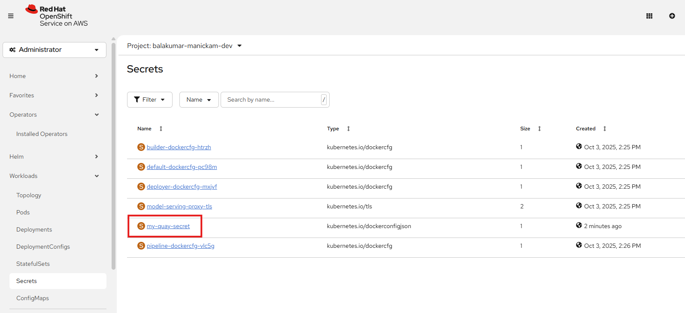

# Lab 2: Deploy Application Using OpenShift Pipelines

In this lab, we will automate the build and deployment of the `vote-ui` and `vote-api` applications using **OpenShift Pipelines** (Tekton).

Instead of manually building images and deploying them (as we did in Lab 1), we will now build a **CI/CD pipeline** that automatically:
1. Fetches source code from GitHub
2. Builds container images
3. Pushes them to **Quay.io** (our container registry)
4. Verify security scanning details
4. Deploys them to the OpenShift cluster

Below is the high-level flow of our pipeline:


</br>

## Part 1 – Fork the Repositories

We’ll start by creating your own GitHub copies of the repositories.

1. Log in to your GitHub account.
2. Fork the following repositories into your account:
   - [pipelines-vote-api](https://github.com/apj-aih/pipelines-vote-api)
   - [pipelines-vote-ui](https://github.com/apj-aih/pipelines-vote-ui)
3. Confirm that you now see them under **your GitHub username**.

</br>


</br>

## Part 2 – Introduction to OpenShift Pipelines

**OpenShift Pipelines** is a Kubernetes-native CI/CD framework based on **Tekton**.

Key features:
- Standard CI/CD pipeline definition based on Tekton
- Build images with tools like **S2I, Buildah, Buildpacks, Kaniko**
- Deploy to Kubernetes, serverless, or VMs
- Easy to extend and integrate with existing tools
- Scales pipelines on-demand
- Portable across any Kubernetes platform
- Designed for microservices and decentralized teams
- Integrated with the **OpenShift Developer Console**

</br>


</br>

## Part 3 – Building blocks of Tekton

Tekton building blocks:

- **Task**: a reusable set of steps (e.g., build an image)
- **Pipeline**: definition of ordered tasks
- **TaskRun**: execution of a Task
- **PipelineRun**: execution of a Pipeline (includes multiple TaskRuns)


</br>

## Part 4 – Create Quay.io Credentials Secret

We need a secret in OpenShift to allow pipelines to push images to Quay.io.

1. Create a **Quay.io robot account** or use your main account credentials.
2. In OpenShift Web Console:
   - Navigate to your project.
   - Go to **Workloads → Secrets → Create Image pull secret**.
   - Add your Quay.io username & password/token.
   - Name the secret: `<YOUR-SECRET-NAME>`
   - Authentication Type: **Image registry credentials**.
   - Registry server address: **quay.io**
   - Username: `<Your-Quay-UserName>`
   - Password: `<Your-Quay-Set-Password>`

   Alternatively, you can create the secret using the file downloaded earlier:
   ```bash
   oc create -f `<YOUR-SECRET-NAME>`.yml
   ```

3. Link the secret to the pipeline service account, you should run below command in the Terminal:
   ```bash
   oc secrets link pipeline `<YOUR-SECRET-NAME>` --for=pull,mount

   #Example:
   #oc secrets link pipeline balslive-pull-secret --for=pull,mount
   ```



</br>

## Part 5 – Create Tasks via Web Console

We will now create the tasks in the **OpenShift Developer Console**. Let's create two tasks (1) apply-manifests and (1) update-deployment:

1. Go to **Pipelines → Tasks → Create Task**.

2. Copy & paste below mentioned apply-manifests yaml & click `Create`:
```yaml
apiVersion: tekton.dev/v1
kind: Task
metadata:
  name: apply-manifests
spec:
  workspaces:
  - name: source
  params:
    - name: manifest_dir
      description: The directory in source that contains yaml manifests
      type: string
      default: "k8s"
  steps:
    - name: apply
      image: image-registry.openshift-image-registry.svc:5000/openshift/cli:latest
      workingDir: /workspace/source
      command: ["/bin/bash", "-c"]
      args:
        - |-
          echo Applying manifests in $(inputs.params.manifest_dir) directory
          oc apply -f $(inputs.params.manifest_dir)
          echo -----------------------------------
```


3. Simaly create deployment task. Copy & paste below mentioned update-deployment yaml & click `Create`:
```yaml
apiVersion: tekton.dev/v1
kind: Task
metadata:
  name: update-deployment
spec:
  params:
    - name: deployment
      description: The name of the deployment patch the image
      type: string
    - name: IMAGE
      description: Location of image to be patched with
      type: string
  steps:
    - name: patch
      image: image-registry.openshift-image-registry.svc:5000/openshift/cli:latest
      command: ["/bin/bash", "-c"]
      args:
        - |-
          oc patch deployment $(inputs.params.deployment) --patch='{"spec":{"template":{"spec":{
            "containers":[{
              "name": "$(inputs.params.deployment)",
              "image":"$(inputs.params.IMAGE)"
            }]
          }}}}'

          patched_at_timestamp=`date +%s`
          oc patch deployment $(inputs.params.deployment) --patch='{"spec":{"template":{"metadata":{
            "labels":{
              "patched_at": '\"$patched_at_timestamp\"'
            }
          }}}}'
```


4. You should see two tasks as shown below:


</br>

## Part 5 – Create Pipeline via Web Console

We will now create the pipeline in the **OpenShift Developer Console**.

1. Go to **Pipelines → Pipelines → Create Pipeline**.
2. Import or apply the pipeline YAML provided:

```yaml
apiVersion: tekton.dev/v1
kind: Pipeline
metadata:
  name: build-upload-quayio-and-deploy
spec:
  workspaces:
  - name: shared-workspace
  params:
  - name: deployment-name
    type: string
    description: name of the deployment to be patched
  - name: git-url
    type: string
    description: url of the git repo for the code of deployment
  - name: git-revision
    type: string
    description: revision to be used from repo of the code for deployment
    default: master
  - name: IMAGE
    type: string
    description: image to be build and pushed to OpenShift internal registry
  - name: STORAGE_DRIVER
    type: string
    default: 'vfs'
  - name: quay-io-account
    type: string
    default: ""
  - name: quay-io-repository
    type: string
    default: ""
  - name: quay-io-image-tag-name
    type: string
    default: "latest"

  tasks:
  - name: fetch-repository
    taskRef:
      resolver: cluster
      params:
      - name: kind
        value: task
      - name: name
        value: git-clone
      - name: namespace
        value: openshift-pipelines
    workspaces:
    - name: output
      workspace: shared-workspace
    params:
    - name: URL
      value: $(params.git-url)
    - name: SUBDIRECTORY
      value: ""
    - name: DELETE_EXISTING
      value: "true"
    - name: REVISION
      value: $(params.git-revision)

  - name: build-image
    taskRef:
      resolver: cluster
      params:
      - name: kind
        value: task
      - name: name
        value: buildah
      - name: namespace
        value: openshift-pipelines
    params:
    - name: IMAGE
      value: $(params.IMAGE)
    - name: STORAGE_DRIVER
      value: $(params.STORAGE_DRIVER)
    workspaces:
    - name: source
      workspace: shared-workspace
    runAfter:
    - fetch-repository

  - name: push-image-to-quay
    taskRef:
      resolver: cluster
      params:
      - name: kind
        value: task
      - name: name
        value: skopeo-copy
      - name: namespace
        value: openshift-pipelines
    params:
    - name: SOURCE_IMAGE_URL
      value: docker://$(params.IMAGE)
    - name: DESTINATION_IMAGE_URL
      value: docker://quay.io/$(params.quay-io-account)/$(params.quay-io-repository):$(params.quay-io-image-tag-name)
    - name: SRC_TLS_VERIFY
      value: "false"
    - name: DEST_TLS_VERIFY
      value: "true"
    runAfter:
    - build-image
    
  - name: manual-approval
    taskRef:
      apiVersion: openshift-pipelines.org/v1alpha1
      kind: ApprovalTask
    params:
    - name: approvers
      value:
      - balslive
    - name: description
      value: Manual deployment approval - please approve or reject
    - name: numberOfApprovalsRequired
      value: '1'
    - name: timeout
      value: '120m'
    runAfter:
    - push-image-to-quay
    
  - name: apply-manifests
    taskRef:
      name: apply-manifests
    workspaces:
    - name: source
      workspace: shared-workspace
    runAfter:
    - manual-approval

  - name: update-deployment
    taskRef:
      name: update-deployment
    params:
    - name: deployment
      value: $(params.deployment-name)
    - name: IMAGE
      value: quay.io/$(params.quay-io-account)/$(params.quay-io-repository):$(params.quay-io-image-tag-name)
    runAfter:
    - apply-manifests
```

3. Save the pipeline.
4. Manually create a **PipelineRun**:
   - Go to your pipeline.
   - Click **Actions → Start**.
   - Provide required parameters (e.g., Git URL, Image URL, Secret).

```yaml
apiVersion: tekton.dev/v1
kind: PipelineRun
metadata:
  generateName: build-deploy-api-pipelinerun-quay-
spec:
  pipelineRef:
    name: build-upload-quayio-and-deploy
  params:
    - name: deployment-name
      value: pipelines-vote-api
    - name: git-url
      value: https://github.com/apj-aih/pipelines-vote-api.git
    - name: IMAGE
      value: image-registry.openshift-image-registry.svc:5000/balslive-dev/pipelines-vote-api
    - name: quay-io-account
      value: balslive
    - name: quay-io-repository
      value: vote-api
    - name: quay-io-image-tag-name
      value: v2
    - name: STORAGE_DRIVER
      value: vfs
  workspaces:
    - name: shared-workspace
      volumeClaimTemplate:
        spec:
          accessModes:
            - ReadWriteOnce
          resources:
            requests:
              storage: 1Gi
```

**[Add Screenshot]**: PipelineRun executing in console.

```yaml
apiVersion: tekton.dev/v1
kind: PipelineRun
metadata:
  generateName: build-deploy-ui-pipelinerun-quay-
spec:
  pipelineRef:
    name: build-upload-quayio-and-deploy
  params:
    - name: deployment-name
      value: pipelines-vote-ui
    - name: git-url
      value: https://github.com/apj-aih/pipelines-vote-ui.git
    - name: IMAGE
      value: image-registry.openshift-image-registry.svc:5000/balslive-dev/pipelines-vote-ui
    - name: quay-io-account
      value: balslive
    - name: quay-io-repository
      value: vote-ui
    - name: quay-io-image-tag-name
      value: v2
    - name: STORAGE_DRIVER
      value: vfs
  workspaces:
    - name: shared-workspace
      volumeClaimTemplate:
        spec:
          accessModes:
            - ReadWriteOnce
          resources:
            requests:
              storage: 1Gi
```

</br>

## Part 6 – Add GitHub Webhook Integration

Now we will automate pipeline triggers when code is pushed.

1. Create a **TriggerTemplate**, **TriggerBinding**, **Trigger**, and **EventListener**.
2. Apply YAMLs for each via Web Console:

```yaml
apiVersion: triggers.tekton.dev/v1beta1
kind: TriggerTemplate
metadata:
  name: vote-app
spec:
  params:
  - name: git-repo-url
    description: The git repository url
  - name: git-revision
    description: The git revision
    default: master
  - name: git-repo-name
    description: The name of the deployment to be created / patched

  resourcetemplates:
  - apiVersion: tekton.dev/v1
    kind: PipelineRun
    metadata:
      generateName: build-deploy-$(tt.params.git-repo-name)-
    spec:
      taskRunTemplate:
        serviceAccountName: pipeline
      pipelineRef:
        name: build-upload-quayio-and-deploy
      params:
      - name: deployment-name
        value: $(tt.params.git-repo-name)
      - name: git-url
        value: $(tt.params.git-repo-url)
      - name: git-revision
        value: $(tt.params.git-revision)
      - name: IMAGE
        value: image-registry.openshift-image-registry.svc:5000/$(context.pipelineRun.namespace)/$(tt.params.git-repo-name)
      - name: quay-io-account
        value: balslive
      - name: quay-io-repository
        value: vote-ui
      - name: quay-io-image-tag-name
        value: latest
      - name: STORAGE_DRIVER
        value: vfs
      workspaces:
      - name: shared-workspace
        volumeClaimTemplate:
          spec:
            accessModes:
              - ReadWriteOnce
            resources:
              requests:
                storage: 500Mi
```

```yaml
apiVersion: triggers.tekton.dev/v1beta1
kind: TriggerBinding
metadata:
  name: vote-app
spec:
  params:
  - name: git-repo-url
    value: $(body.repository.clone_url)
  - name: git-repo-name
    value: $(body.repository.name)
  - name: git-revision
    value: $(body.head_commit.id)
```

```yaml
apiVersion: v1
kind: Secret
metadata:
  name: github-secret
type: Opaque
stringData:
  secretToken: "1234567"
```

```yaml
apiVersion: triggers.tekton.dev/v1beta1
kind: EventListener
metadata:
  name: vote-app
spec:
  serviceAccountName: pipeline
  triggers:
    - name: vote-app-trigger
      serviceAccountName: pipeline
      interceptors:
        - ref:
            name: "github"
          params:
            - name: "secretRef"
              value:
                secretName: github-secret
                secretKey: secretToken
            - name: "eventTypes"
              value: ["push"]
      bindings:
        - ref: vote-app     # TriggerBinding
      template:
        ref: vote-app       # TriggerTemplate
```

3. After creating the EventListener, expose it as a Route:
   ```bash
   oc expose svc el-vote-app
   
   echo "$(oc  get route el-vote-app --template='http://{{.spec.host}}')"
   ```
   Copy the EventListener route URL.

4. In your forked GitHub repo:
   - Go to **Settings → Webhooks → Add Webhook**.
   - Paste the EventListener route URL.
   - Select `application/json`.
   - Choose **Just the push event**.

**[Add Screenshot]**: Webhook setup in GitHub.

</br>

## Part 7 – Test the Pipeline

1. Make a small commit in your forked repo (e.g., edit `README.md`).
2. Push the commit to GitHub.
3. Watch the pipeline automatically start in **OpenShift Pipelines → PipelineRuns**.
4. Verify that images are built and pushed to Quay.io, and the application is redeployed.

**[Add Screenshot]**: Pipeline running after webhook trigger.

</br>

# ✅ Lab 2 Completed

You have successfully:
- Forked GitHub repositories  
- Created OpenShift Pipelines (Tekton)  
- Secured Quay.io credentials  
- Configured a GitHub webhook for CI/CD  
- Triggered a pipeline automatically with a commit  
