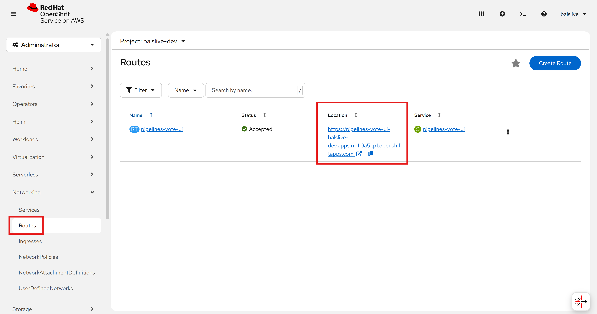

# Lab 2: Deploy Application Using OpenShift Pipelines

In this lab, we will automate the build and deployment of the `vote-ui` and `vote-api` applications using **OpenShift Pipelines** (Tekton).

Instead of manually building images and deploying them (as we did in Lab 1), we will now build a **CI/CD pipeline** that automatically:
1. Fetches source code from GitHub
2. Builds container images
3. Pushes them to **Quay.io** (our container registry)
4. Verify security scanning details
5. Deploys them to the OpenShift cluster

Below is the high-level flow of our pipeline:


</br>

## Part 1 – Fork the Repositories

We’ll start by creating your own GitHub copies of the repositories.

1. Log in to your GitHub account.
2. Fork the following repositories into your account:
   - [pipelines-vote-api](https://github.com/apj-aih/pipelines-vote-api)
</br>

</br>
   - [pipelines-vote-ui](https://github.com/apj-aih/pipelines-vote-ui)


3. Confirm that you now see them under **your GitHub username**.

</br>

## Part 2 – Introduction to OpenShift Pipelines

**OpenShift Pipelines** is a Kubernetes-native CI/CD framework based on **Tekton**.

Key features:
- Standard CI/CD pipeline definition based on Tekton
- Build images with tools like **S2I, Buildah, Buildpacks, Kaniko**
- Deploy to Kubernetes, serverless, or VMs
- Easy to extend and integrate with existing tools
- Scales pipelines on-demand
- Portable across any Kubernetes platform
- Designed for microservices and decentralized teams
- Integrated with the **OpenShift Developer Console**


</br>

## Part 3 – Building blocks of Tekton

Tekton building blocks:

- **Task**: a reusable set of steps (e.g., build an image)
- **Pipeline**: definition of ordered tasks
- **TaskRun**: execution of a Task
- **PipelineRun**: execution of a Pipeline (includes multiple TaskRuns)


</br>

## Part 4 – Create Quay.io Credentials Secret

We need a secret in OpenShift to allow pipelines to push images to Quay.io.

1. Use your Quay.io login account credentials to create the secret.
2. In OpenShift Web Console:
   - Navigate to your project.
   - Go to **Workloads → Secrets → Create Image pull secret**.
   - Add your Quay.io username & password/token.
   - Name the secret: `<YOUR-SECRET-NAME>`
   - Authentication Type: **Image registry credentials**.
   - Registry server address: **quay.io**
   - Username: `<Quay-UserName>`
   - Password: `<Quay-Set-Password>`


   Alternatively, you can create the secret using the file downloaded earlier in Lab 1:
   ```bash
   oc create -f <YOUR-SECRET-NAME>.yml

   #Example
   #oc create -f user-secret.yml
   ```

3. Link the secret to the pipeline service account, you should run below command in the Terminal:
   ```bash
   oc get secrets

   oc secrets link pipeline <YOUR-SECRET-NAME> --for=pull,mount

   #Example:
   #oc secrets link pipeline user-pull-secret --for=pull,mount
   ```
   

</br>

## Part 5 – Create Tasks via Web Console

We will now create the tasks in the **OpenShift Developer Console**. Let's create two tasks (1) apply-manifests and (2) update-deployment:

1. Go to **Pipelines → Tasks → Create Task**


2. Copy & paste below mentioned apply-manifests YAML & click `Create`:

    ```yaml
    apiVersion: tekton.dev/v1
    kind: Task
    metadata:
      name: apply-manifests
    spec:
      workspaces:
      - name: source
      params:
        - name: manifest_dir
          description: The directory in source that contains yaml manifests
          type: string
          default: "k8s"
      steps:
        - name: apply
          image: image-registry.openshift-image-registry.svc:5000/openshift/cli:latest
          workingDir: /workspace/source
          command: ["/bin/bash", "-c"]
          args:
            - |-
              echo Applying manifests in $(inputs.params.manifest_dir) directory
              oc apply -f $(inputs.params.manifest_dir)
              echo -----------------------------------
    ```
    

3. Similarly create deployment task. Copy & paste below mentioned update-deployment YAML & click `Create`:
    ```yaml
    apiVersion: tekton.dev/v1
    kind: Task
    metadata:
      name: update-deployment
    spec:
      params:
        - name: deployment
          description: The name of the deployment to patch the image
          type: string
        - name: IMAGE
          description: Location of image to be patched with
          type: string
      steps:
        - name: patch
          image: image-registry.openshift-image-registry.svc:5000/openshift/cli:latest
          command: ["/bin/bash", "-c"]
          args:
            - |-
              oc patch deployment $(inputs.params.deployment) --patch='{"spec":{"template":{"spec":{
                "containers":[{
                  "name": "$(inputs.params.deployment)",
                  "image":"$(inputs.params.IMAGE)"
                }]
              }}}}'
    
              # issue: https://issues.redhat.com/browse/SRVKP-2387
              # images are deployed with tag. on rebuild of the image tags are not updated, hence redeploy is not happening
              # as a workaround update a label in template, which triggers redeploy pods
              # target label: "spec.template.metadata.labels.patched_at"
              # NOTE: this workaround works only if the pod spec has imagePullPolicy: Always
              patched_at_timestamp=`date +%s`
              oc patch deployment $(inputs.params.deployment) --patch='{"spec":{"template":{"metadata":{
                "labels":{
                  "patched_at": '\"$patched_at_timestamp\"'
                }
              }}}}'
    ```
    

4. You should see two tasks as shown below:


</br>

## Part 5 – Create Pipeline via Web Console

We will now create the pipeline in the **OpenShift Developer Console**.

1. Go to **Pipelines → Pipelines → Create Pipeline**.


2. Select YAML view. Remove the default content & paste the below mentioned pipeline YAML content:


    ```yaml
    apiVersion: tekton.dev/v1
    kind: Pipeline
    metadata:
      name: build-upload-quayio-and-deploy
    spec:
      params:
      - name: deployment-name
        type: string
        description: name of the deployment to be patched
      - name: git-url
        type: string
        description: url of the git repo for the code of deployment
      - name: git-revision
        type: string
        description: revision to be used from repo of the code for deployment
        default: master
      - name: IMAGE
        type: string
        description: image to be build and pushed to OpenShift internal registry
      - name: STORAGE_DRIVER
        type: string
        default: 'vfs'
      - name: quay-io-account
        type: string
        default: ""
      - name: quay-io-repository
        type: string
        default: ""
      - name: quay-io-image-tag-name
        type: string
        default: "latest"
      tasks:
        - name: fetch-repository
          params:
            - name: URL
              value: $(params.git-url)
            - name: SUBDIRECTORY
              value: ''
            - name: DELETE_EXISTING
              value: 'true'
            - name: REVISION
              value: $(params.git-revision)
          taskRef:
            params:
              - name: kind
                value: task
              - name: name
                value: git-clone
              - name: namespace
                value: openshift-pipelines
            resolver: cluster
          workspaces:
            - name: output
              workspace: shared-workspace
        - name: build-image
          params:
            - name: IMAGE
              value: $(params.IMAGE)
            - name: STORAGE_DRIVER
              value: $(params.STORAGE_DRIVER)
          runAfter:
            - fetch-repository
          taskRef:
            params:
              - name: kind
                value: task
              - name: name
                value: buildah
              - name: namespace
                value: openshift-pipelines
            resolver: cluster
          workspaces:
            - name: source
              workspace: shared-workspace
        - name: push-image-to-quay
          params:
            - name: SOURCE_IMAGE_URL
              value: 'docker://$(params.IMAGE)'
            - name: DESTINATION_IMAGE_URL
              value: 'docker://quay.io/$(params.quay-io-account)/$(params.quay-io-repository):$(params.quay-io-image-tag-name)'
            - name: SRC_TLS_VERIFY
              value: 'false'
            - name: DEST_TLS_VERIFY
              value: 'true'
          runAfter:
            - build-image
          taskRef:
            params:
              - name: kind
                value: task
              - name: name
                value: skopeo-copy
              - name: namespace
                value: openshift-pipelines
            resolver: cluster
        - name: apply-manifests
          runAfter:
            - push-image-to-quay
          taskRef:
            kind: Task
            name: apply-manifests
          workspaces:
            - name: source
              workspace: shared-workspace
        - name: update-deployment
          params:
            - name: deployment
              value: $(params.deployment-name)
            - name: IMAGE
              value: 'quay.io/$(params.quay-io-account)/$(params.quay-io-repository):$(params.quay-io-image-tag-name)'
          runAfter:
            - apply-manifests
          taskRef:
            kind: Task
            name: update-deployment
      workspaces:
        - name: shared-workspace
    ```

3. Select the `Pipeline builder` to view the details of the pipeline. There are 5 tasks defined in this pipeline as shown below:


4. Click `Create` to save the pipeline.

## Part 6 – Manually run the Pipeline using Pipeline Run

Let's run the Pipeline manually to see how it works. We are going to run the pipeline for both repos we forked earlier (1) vote-api (2) vote-ui.

1. Click **Pipelines → Create PipelineRun** to run the pipeline for vote-api repo.

    

2. Copy & paste the below PipelineRun YAML content for vote-api:

    ```yaml
    apiVersion: tekton.dev/v1
    kind: PipelineRun
    metadata:
      generateName: build-deploy-api-pipelinerun-quay-
    spec:
      pipelineRef:
        name: build-upload-quayio-and-deploy
      params:
        - name: deployment-name
          value: pipelines-vote-api
        - name: git-url
          value: https://github.com/{YOUR_GITHUB_USERNAME}/pipelines-vote-api.git
        - name: IMAGE
          value: image-registry.openshift-image-registry.svc:5000/{YOUR_OCP_PROJECT}/pipelines-vote-api
        - name: quay-io-account
          value: {YOUR_QUAY_USERNAME}
        - name: quay-io-repository
          value: vote-api
        - name: quay-io-image-tag-name
          value: v2
        - name: STORAGE_DRIVER
          value: vfs
      workspaces:
        - name: shared-workspace
          volumeClaimTemplate:
            spec:
              accessModes:
                - ReadWriteOnce
              resources:
                requests:
                  storage: 1Gi
    ```
3. Change (1) `{YOUR_GITHUB_USERNAME}`, (2) `{YOUR_OCP_PROJECT}`, (3) `{YOUR_QUAY_USERNAME}` in the above YAML content.


4. Click `Create` to save the PipelineRun.
5. You should able to see the Pipeline running progress as shown below:
   
6. Click `fetch-repository` task to view the logs. You can see the logs for all the tasks as shown below. Make sure all tasks show success before moving on to the next step.
   
7. You can view the deployed vote-api pod in **Workloads  → Pods** with status **Running**
   
8. Let's run the pipeline for vote-ui repo. Click **Pipelines → Create PipelineRun** to the run the pipeline.
    
9. Copy & paste the below PipelineRun YAML content for vote-ui:

    ```yaml
    apiVersion: tekton.dev/v1
    kind: PipelineRun
    metadata:
      generateName: build-deploy-ui-pipelinerun-quay-
    spec:
      pipelineRef:
        name: build-upload-quayio-and-deploy
      params:
        - name: deployment-name
          value: pipelines-vote-ui
        - name: git-url
          value: https://github.com/{YOUR_GITHUB_USERNAME}/pipelines-vote-ui.git
        - name: IMAGE
          value: image-registry.openshift-image-registry.svc:5000/{YOUR_OCP_PROJECT}/pipelines-vote-ui
        - name: quay-io-account
          value: {YOUR_QUAY_USERNAME}
        - name: quay-io-repository
          value: vote-ui
        - name: quay-io-image-tag-name
          value: v2
        - name: STORAGE_DRIVER
          value: vfs
      workspaces:
        - name: shared-workspace
          volumeClaimTemplate:
            spec:
              accessModes:
                - ReadWriteOnce
              resources:
                requests:
                  storage: 1Gi
    ```
10. Change (1) `{YOUR_GITHUB_USERNAME}`, (2) `{YOUR_OCP_PROJECT}`, (3) `{YOUR_QUAY_USERNAME}` in the above YAML content.
    

11. Click `Create` to save the PipelineRun.
12. Wait for the pipeline to complete all tasks.
    
13. You can view the deployed vote-ui pod in **Workloads  → Pods** with status **Running**
14. Navigate to **Networking  → Routes** and Click the `Location` for pipelines-vote-ui:
    
15. You should see the running application, and the voting functionality should be working.
    


## Part 6 – Add GitHub Webhook Integration

Now we will automate the pipeline using triggers that activate when code is committed and pushed to GitHub.

1. As discussed earlier, we need to create **TriggerTemplate**, **TriggerBinding**, **Trigger**, and **EventListener**. Let's create one by one.
2. Go to **Pipelines → Triggers → Create TriggerTemplate** to create the trigger template.
  
3. Copy & paste the below TriggerTemplate YAML content:
    ```yaml
    apiVersion: triggers.tekton.dev/v1beta1
    kind: TriggerTemplate
    metadata:
      name: vote-app
    spec:
      params:
      - name: git-repo-url
        description: The git repository url
      - name: git-revision
        description: The git revision
        default: master
      - name: git-repo-name
        description: The name of the deployment to be created / patched

      resourcetemplates:
      - apiVersion: tekton.dev/v1
        kind: PipelineRun
        metadata:
          generateName: build-deploy-$(tt.params.git-repo-name)-
        spec:
          taskRunTemplate:
            serviceAccountName: pipeline
          pipelineRef:
            name: build-upload-quayio-and-deploy
          params:
          - name: deployment-name
            value: $(tt.params.git-repo-name)
          - name: git-url
            value: $(tt.params.git-repo-url)
          - name: git-revision
            value: $(tt.params.git-revision)
          - name: IMAGE
            value: image-registry.openshift-image-registry.svc:5000/$(context.pipelineRun.namespace)/$(tt.params.git-repo-name)
          - name: quay-io-account
            value: {YOUR_QUAY_USERNAME}
          - name: quay-io-repository
            value: $(tt.params.git-repo-name)
          - name: quay-io-image-tag-name
            value: latest
          - name: STORAGE_DRIVER
            value: vfs
          workspaces:
          - name: shared-workspace
            volumeClaimTemplate:
              spec:
                accessModes:
                  - ReadWriteOnce
                resources:
                  requests:
                    storage: 500Mi
    ```
4. Change `{YOUR_QUAY_USERNAME}` in the above YAML content.
    

5. Click `Create` to save the TriggerTemplate.

6. Go to **Pipelines → Triggers → Create TriggerBinding** to the create the trigger binding.
  

7. Copy & paste the below TriggerBinding YAML content:

    ```yaml
    apiVersion: triggers.tekton.dev/v1beta1
    kind: TriggerBinding
    metadata:
      name: vote-app
    spec:
      params:
      - name: git-repo-url
        value: $(body.repository.clone_url)
      - name: git-repo-name
        value: $(body.repository.name)
      - name: git-revision
        value: $(body.head_commit.id)
    ```

8. Next, create a trigger secret by going to **Workloads → Secrets → Create From YAML** 
  

9. Copy & paste the below Secret YAML content and click create:
    ```yaml
    apiVersion: v1
    kind: Secret
    metadata:
      name: github-secret
    type: Opaque
    stringData:
      secretToken: "1234567"
    ```
     

10. Let's create Event Listener. Go to **Pipelines → Triggers → Create EventListener**.
  

11. Copy & paste the below EventListener YAML content:

    ```yaml
    apiVersion: triggers.tekton.dev/v1beta1
    kind: EventListener
    metadata:
      name: vote-app
    spec:
      serviceAccountName: pipeline
      triggers:
        - name: vote-app-trigger
          serviceAccountName: pipeline
          interceptors:
            - ref:
                name: "github"
              params:
                - name: "secretRef"
                  value:
                    secretName: github-secret
                    secretKey: secretToken
                - name: "eventTypes"
                  value: ["push"]
          bindings:
            - ref: vote-app     # TriggerBinding
          template:
            ref: vote-app       # TriggerTemplate
    ```

12. After creating the EventListener, expose it as a Route. Run the below command from the Terminal:
    ```bash
    oc expose svc el-vote-app
    ```
    View the URL using below command:
    ```bash
    echo "$(oc  get route el-vote-app --template='http://{{.spec.host}}')"
    ```
    Copy the EventListener route URL shown from the above command.

13. In your forked GitHub repo for `pipelines-vote-ui`:
   - Go to **Settings → Webhooks → Add Webhook**.
     
   - Paste the EventListener route URL as Payload URL.
   - Select `application/json`.
   - Enter secret as `1234567` (trigger secret we created earlier)
   - Choose **Just the push event**.
   - Click `Add webhook`
     

</br>

## Part 7 – Test the Pipeline

1. Make a small commit in your forked repo (e.g., edit `README.md`).
2. Push the commit to GitHub.
3. Watch the pipeline automatically start in **OpenShift Pipelines → PipelineRuns**.
4. Verify that images are built and pushed to Quay.io, and the application is redeployed.
5. You may configure the webhook for `pipelines-vote-api` repo and test it as well.

</br>

# ✅ Lab 2 Completed

You have successfully:
- Forked GitHub repositories  
- Created OpenShift Pipelines (Tekton)  
- Secured Quay.io credentials  
- Configured a GitHub webhook for CI/CD  
- Automatically triggered a pipeline with a commit
