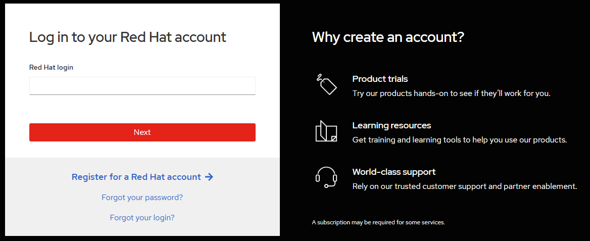

# Pre-Lab Setup Guide

Before attending the DevSecOps lab, please complete the following account setups.  
You will need all three accounts to follow the hands-on exercises.

 

## 1. Red Hat OpenShift Sandbox

The OpenShift Sandbox provides a free, temporary OpenShift cluster for learning and experimentation.

1. Go to: [https://sandbox.redhat.com](https://sandbox.redhat.com)
2. Click **Start using your sandbox**.
3. Sign in with your **Red Hat account**.

   - If you don’t have one, click **Register for a Red Hat account** and complete the registration.
   - Use your work or personal email (both are accepted).

4. After logging in, you can launch a **Developer Sandbox for Red Hat OpenShift**. Click **Try it** in OpenShift box.

   - It provides a free OpenShift cluster valid for 30 days.
   - You will use this during the lab.

 

## 2. Quay.io (Container Registry)

We will use Quay.io to store, scan and share container images.

1. Go to: [https://quay.io](https://quay.io)
2. Click **SIGN IN**.
3. Choose **Sign in with Red Hat**.
   - Use the same Red Hat credentials you created in the previous step.

4. Once logged in, verify that your account shows your account name in Users & Organizations.

 

## 3. GitHub

We will use GitHub to clone and later work with sample code repositories.

1. Go to: [https://github.com](https://github.com)
2. Click **Sign up** if you don’t already have an account.
3. Complete the signup process:
   - Provide username, email, and password.
   - Verify email.
4. Log in and make sure you can access the repositories we’ll use in the lab:
   - [pipelines-vote-ui](https://github.com/openshift/pipelines-vote-ui)
   - [pipelines-vote-api](https://github.com/openshift/pipelines-vote-api)

 

## ✅ Checklist Before the Lab

- [ ] Red Hat Sandbox account created and accessible  
- [ ] Quay.io account created and logged in  
- [ ] GitHub account created and accessible  
- [ ] Able to log in to all three services in your browser  

Bring these credentials with you to the lab. You will need them during the exercises.
